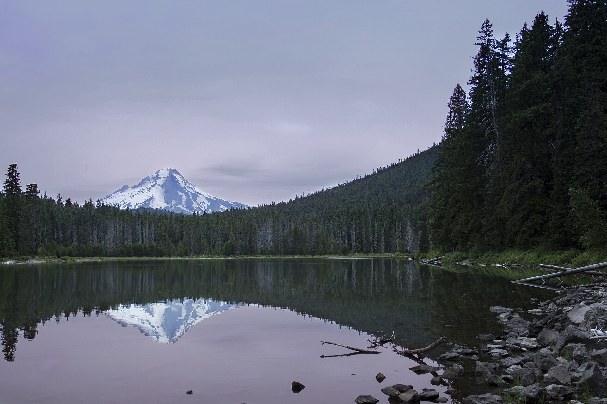
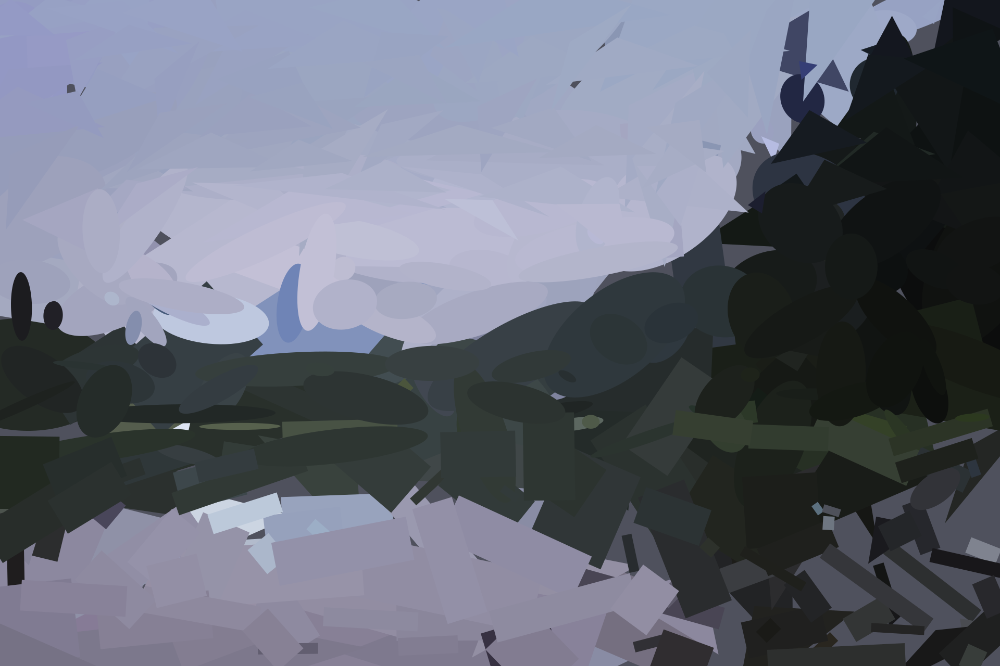

# Shape Vectorizer

Turn a raster image into a compact, editable SVG made from layered ellipses, rectangles, and
triangles. The included model predicts up to 450 objects, and the optional Detailed pass improves
their placement and colours directly against the source pixels.

## Real 450-object example

<table>
  <tr>
    <th>Input photograph</th>
    <th>Detailed · 450 objects</th>
  </tr>
  <tr>
    <td></td>
    <td></td>
  </tr>
</table>

This is an untouched CC0 photograph run through the actual pipeline. The resulting SVG is about 60 KB,
uses exactly 450 foreground vector objects, and reached 25.32 dB PSNR in the final preview. The full run took
11.4 seconds including model initialization and 120 refinement steps.

[Open the SVG](docs/examples/demo_output.svg) ·
[Inspect the target, reconstruction, and error map](docs/examples/demo_comparison.png)

Photograph: [“Lake Mountain Landscape” by Bonnie Moreland](https://commons.wikimedia.org/wiki/File:Lake_Mountain_Landscape.jpg),
released under [CC0 1.0](https://creativecommons.org/publicdomain/zero/1.0/).

## What is included

- A portable, inference-only 450-slot checkpoint.
- A local drag-and-drop web UI with Fast, Quick, Balanced, and Detailed modes.
- A fused CuPy/NVRTC CUDA rasterizer with analytic backward gradients.
- Error-biased native-resolution refinement, so large inputs do not require full-resolution
  differentiable frame buffers.
- Batched shape compositing, learned correction passes, and mixed-precision training.
- A compatible PyTorch renderer when the fused CUDA path is unavailable.
- Read-only GPU temperature and shared-VRAM safety limits for fitting and training.
- SVG constraints for object count and normalized minimum/maximum dimensions.

## Install

Python 3.11 or newer is required. An NVIDIA CUDA GPU is strongly recommended for refined modes.

```powershell
python -m venv .venv
.\.venv\Scripts\Activate.ps1
python -m pip install --upgrade pip
python -m pip install -e ".[cuda]"
```

If PyTorch needs a platform-specific CUDA wheel, install it using the command from the
[PyTorch installer](https://pytorch.org/get-started/locally/) before the editable install.

## Use the UI

On Windows, double-click `Start Vector UI.bat`. Or launch it from a terminal:

```powershell
python -m vectorlearner.ui --open
```

Choose an image, mode, and object count, then download the generated SVG. Uploaded images and run
artifacts stay under the ignored `runs/ui` folder. Closing the launcher or pressing Ctrl+C stops
the local server.

## Use the CLI

Fast model inference:

```powershell
python -m vectorlearner.infer `
  models/shape_vectorizer_v2.pt `
  "C:\path\to\image.jpg" `
  --shapes 450 `
  --output-dir runs/inference
```

Direct fitting without the trained initializer:

```powershell
python -m vectorlearner.fit `
  "C:\path\to\large-image.png" `
  --output-dir runs/direct-fit `
  --max-shapes 450 `
  --stages 16,32,64,128,256,450 `
  --steps-per-stage 120
```

Object coordinates are normalized, so training resolution does not set the SVG output size. Large
inputs are sampled at native resolution during refinement while previews remain memory-bounded.

## Train the model

Download the external DIV2K training set (about 3.3 GiB extracted):

```powershell
python scripts/download_div2k.py
```

The downloader uses the [official ETH Zurich DIV2K source](https://data.vision.ee.ethz.ch/cvl/DIV2K/),
validates the archive, extracts exactly 800 PNGs, and removes the ZIP by default. The entire `data`
folder is ignored by Git. Review DIV2K's academic-research terms before use.

Run a short synthetic check:

```powershell
python -m vectorlearner.train_v2 `
  --steps 500 `
  --image-size 256 `
  --shape-schedule 32,128,450 `
  --output-dir runs/synthetic
```

Then train on high-resolution DIV2K crops:

```powershell
python -m vectorlearner.train_v2 `
  --data-dir data/DIV2K/DIV2K_train_HR `
  --steps 10000 `
  --batch-size 1 `
  --image-size 192 `
  --max-shapes 450 `
  --shape-schedule 32,64,128,256,450 `
  --correction-steps 1 `
  --renderer-backend auto `
  --output-dir runs/v2-optimized
```

Export a training checkpoint without optimizer state or training metadata:

```powershell
python scripts/export_inference_checkpoint.py `
  runs/v2-optimized/checkpoint_0010000.pt `
  models/shape_vectorizer_v2.pt
```

## Test

```powershell
python -m unittest discover -s tests -v
```

The source code is MIT licensed. See [MODEL_CARD.md](MODEL_CARD.md) for checkpoint provenance and
dataset notes.
